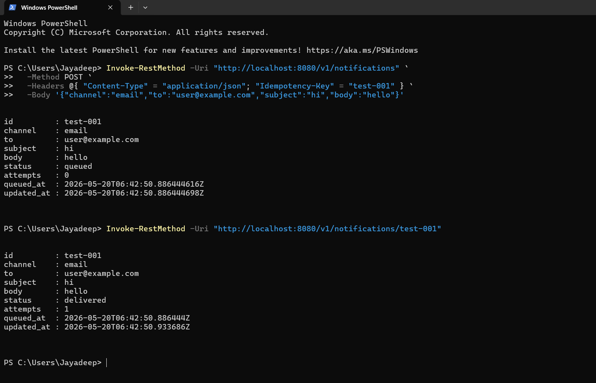

# Notification-system-go


A horizontally scalable, multi-channel notification service in Go. Built to demonstrate distributed-systems patterns - Redis-backed job queues, worker pools, retries with exponential backoff, pluggable channel adapters, and full observability.

> **Status:** scaffold + working dev stack. Run `make up` and you have a queue, workers, Postgres, and a REST API on `localhost:8080`.

---

## Architecture

```
       ┌─────────────┐
HTTP → │  REST API   │ ──┐
       └─────────────┘   │  enqueue
                         ▼
                   ┌──────────┐         ┌──────────────────┐
                   │  Redis   │  ◄──── │  Worker Pool (N) │ ──► Email / SMS / Push
                   │  Stream  │         └──────────────────┘
                   └──────────┘                  │
                         │                       │ log
                         ▼                       ▼
                   ┌──────────┐         ┌──────────────────┐
                   │ Postgres │ ◄────── │  Delivery Logs   │
                   └──────────┘         └──────────────────┘
                         ▲
                         │ metrics
                   ┌──────────┐
                   │Prometheus│ ──► Grafana
                   └──────────┘
```

**Properties**

- **At-least-once delivery** via Redis Streams + consumer groups
- **Exponential backoff** retry (default 3 attempts: 5s, 25s, 125s) → dead-letter queue
- **Per-channel rate limiting** (token bucket)
- **Idempotency** via client-supplied `idempotency_key`
- **Observability** - structured logs (zerolog), Prometheus metrics, healthcheck endpoint
- **Graceful shutdown** - workers drain in-flight jobs before exit

---

## Quick start

```bash
# Bring up Postgres, Redis, API, and 3 workers
make up

# Send a test notification
curl -X POST http://localhost:8080/v1/notifications \
  -H 'Content-Type: application/json' \
  -H 'Idempotency-Key: demo-001' \
  -d '{
    "channel": "email",
    "to":      "user@example.com",
    "subject": "Hello",
    "body":    "Welcome to the platform"
  }'

# Check delivery status
curl http://localhost:8080/v1/notifications/demo-001
```

---

## API

| Method | Path                              | Description                          |
|--------|-----------------------------------|--------------------------------------|
| POST   | `/v1/notifications`               | Enqueue a notification               |
| GET    | `/v1/notifications/:id`           | Fetch delivery status + history      |
| GET    | `/healthz`                        | Liveness probe                       |
| GET    | `/readyz`                         | Readiness probe (Redis + Postgres)   |
| GET    | `/metrics`                        | Prometheus metrics                   |

### POST /v1/notifications

```json
{
  "channel": "email" | "sms" | "push",
  "to":      "<destination>",
  "subject": "<subject (email only)>",
  "body":    "<message body>",
  "metadata": { "user_id": "...", "campaign": "..." }
}
```

Headers:
- `Idempotency-Key: <unique-id>` - required. Submitting the same key returns the original result.

Response: `202 Accepted`
```json
{ "id": "demo-001", "status": "queued", "queued_at": "2026-05-08T14:00:00Z" }
```

---

## Configuration

All via environment variables (see `.env.example`):

| Var                    | Default                         | Description                  |
|------------------------|---------------------------------|------------------------------|
| `HTTP_ADDR`            | `:8080`                         | API listen address           |
| `REDIS_URL`            | `redis://localhost:6379`        | Redis connection             |
| `POSTGRES_URL`         | `postgres://...localhost:5432`  | Postgres connection          |
| `WORKER_CONCURRENCY`   | `5`                             | Workers per channel          |
| `RETRY_MAX_ATTEMPTS`   | `3`                             | Retry attempts before DLQ    |
| `RATE_LIMIT_EMAIL_RPS` | `50`                            | Email channel rate limit     |
| `LOG_LEVEL`            | `info`                          | `debug` / `info` / `warn`    |

---

## Layout

```
.
├── cmd/
│   ├── api/         # REST API entrypoint
│   └── worker/      # Worker entrypoint
├── internal/
│   ├── api/         # HTTP handlers, middleware
│   ├── queue/       # Redis Streams wrapper
│   ├── worker/      # Worker pool, retry logic
│   ├── channels/    # Email / SMS / Push adapters
│   ├── storage/     # Postgres persistence
│   ├── models/      # Domain types
│   └── observability/  # Logging, metrics, tracing
├── pkg/
│   └── ratelimit/   # Reusable token-bucket limiter
├── migrations/      # SQL migrations
├── deploy/
│   ├── grafana/     # Dashboards
│   └── prometheus/  # Scrape config
├── Dockerfile
├── docker-compose.yml
└── Makefile
```

---

## Performance

Tested locally with k6 on Windows 11 + Docker Desktop (WSL 2 backend). Load profile ramps from 50 → 500 concurrent virtual users over 4 minutes against the full stack (1 API container + 3 worker containers + Postgres + Redis).

| Metric                              | Value         |
|-------------------------------------|---------------|
| Total requests                      | **40,866**    |
| Sustained throughput                | **170 req/s** |
| Success rate                        | **98.77%**    |
| p50 latency (POST /v1/notifications)| **17 ms**     |
| p95 latency at peak (500 VUs)       | **349 ms**    |
| End-to-end latency (POST → delivered, low load) | **~47 ms** |

### Observed bottlenecks

At the 500-VU peak the system breaches the p95 < 200ms target (reaches 349ms) and the < 1% error budget (1.22% timeouts). Profiling pointed at:

- **Postgres connection pool saturation** - pgxpool defaults to a small max-connection count under high write fan-out.
- **Redis XAdd contention** - single-stream writes serialize at the Redis side.

Both are addressable: tune `pgxpool.Config.MaxConns`, partition the stream by channel, and add a write-through buffer for delivery logs. Running on native Linux instead of Docker Desktop on Windows would also remove a layer of networking overhead.

### Reproduce

```bash
docker compose up -d
k6 run loadtest/baseline.js
```

## Deployment

A `fly.toml` is included. Deploy with:

```bash
fly launch --copy-config --no-deploy
fly secrets set POSTGRES_URL=... REDIS_URL=...
fly deploy
```

---

## What I learned building this

- **At-least-once vs exactly-once** - exactly-once delivery across an unreliable channel (SMTP, SMS) is impossible; the achievable contract is at-least-once + idempotency on the receiver side.
- **Redis Streams beat List + LPOP** for queues - consumer groups give you parallel work distribution with auto-claim on stuck messages.
- **Dead-letter queues are essential** - without one, a single bad payload can wedge a worker pool indefinitely.
- **Rate-limit by channel, not globally** - Twilio's SMS limit ≠ SendGrid's email limit, and a global limiter starves the faster channels.
- **Graceful shutdown is half the work** - handling SIGTERM correctly (drain queue, close DB, flush logs) took ~30% of the total dev time and is the difference between zero downtime and data loss on deploys.

---

